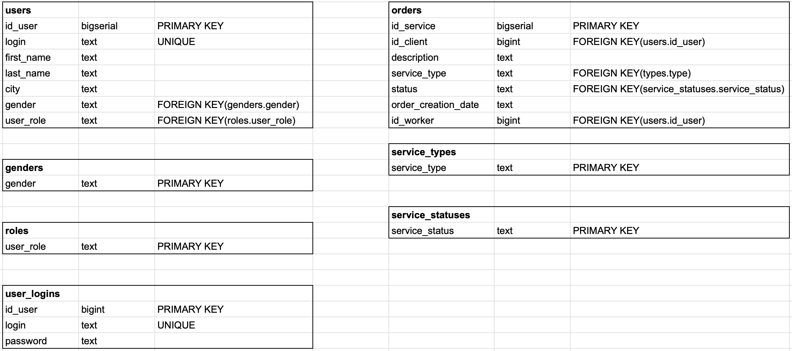

Сайт для клиентов и работников, который помогает заказчикам найти иполнителей и исполнителям найти работу

Пользователь может:
* просмотреть список всех заказов, 
* просмотреть детали каждого заказа, 
* зарегистрироваться, 
* аутентифицироваться.  

Каждый заказ хранит информацию: описание заказа, адрес, тип заказа и статус заказа. 
Аутентифицированный пользователь имеет дополнительную возможность: 
изменение персональной информации.
Аутентифицированный пользователь имеет роль (клиент или работник).

Клиент может:
* оформлять новый заказ,
* просматривать все свои заказы,
* просматривать заказы, на которые откликнулись работники,
* удалять свободные заказы,
* подтверждать выполненный работником заказ.

Работник имеет возможность: 
* взять в работу свободный заказ,
* изменить статус выполненного заказа,
* просматривать все свои отклики.

